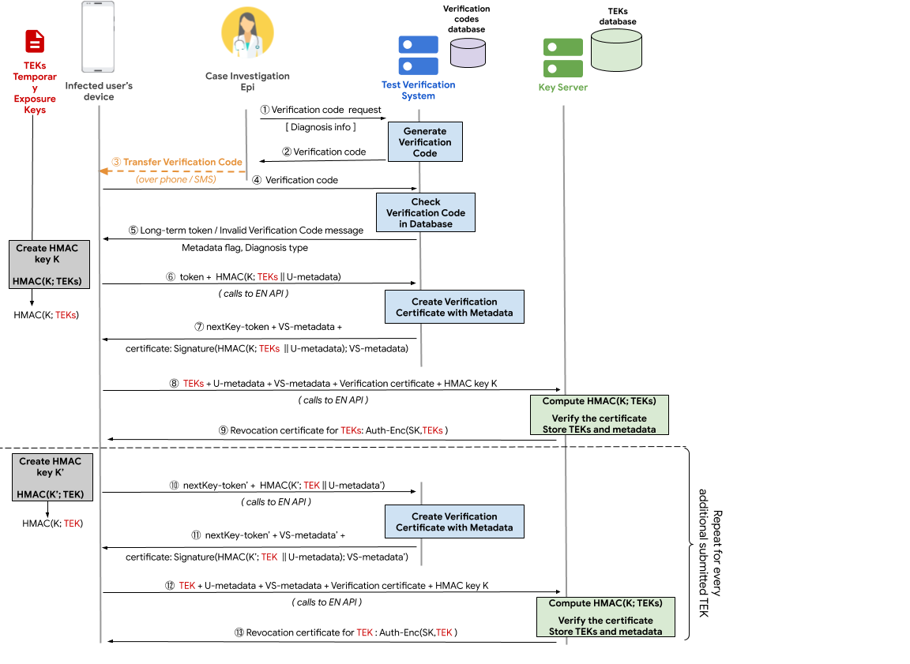

# Verification Server and Key Submission Process

The following describes endpoints and their function to ensure the NYS Covid Tracking system is compatible with the APHL Exposure Notification Verification and Key Servers defined in https://developers.gogle.com/android/exposure-notifications/verification-system. The NYS Covid Tracking system will launch using NYS specific verification and key servers with the intent of migrating to the national APHL key server when ready. Ensuring that the NYS verification server, NYS key server, and NYS Mobile Exposure Notification App are compatible with the national verification and key servers will allow for a seamless transition.

The following Verification Flow Diagram can be used to help indicate which part of the process each step below is referring to.

## Definitions

* __Case Investigation Epidemiologist (EPI)__: A Case Investigation Epidemiologist is a public health official who contacts a user upon a positive diagnosis. They may also be referred to as Contact Tracers.
* __Temporary Exposure Key (TEK)__: A key that's randomly generated once every 24 hours. It remains on the device for up to 14 days. In the event that there's a positive diagnosis of COVID-19, and upon permission granted from the user, these keys are provided to the app.
* __Verification Server Metadata (VS-metadata)__: Metadata about the user that was entered by an EPI and submitted when requesting a verification code. It can include things such as symptom onset date, test date, and transmission risk.
* __User Metadata (U-metadata)__: Metadata about the user that was entered by the user. It can include things such as symptom onseet date and test date.
* __Public Health Authority (PHA)__: NYS Department of Health
* __Verification Code (VC)__: A verification code is an 8 digit number generated by a public health official and given to a user. This is the code that allows app users to begin the process of submitting their TEKs to the key server.
* __Verification Token (VT)__: A verification token is a randomly generated UUID value returned to a user when they submit a valid verification code.
* __Verification JWT__: A valid JWT containing a valid verification token
* __TEK Submission JWT__: JWT signed by the verification server allowing the user to submit TEKs to the key server

## Database Tables

#### `verification_codes`

<table>
<tr>
<th>`verification_code`</th>
<th>`metadata`</th>
<th>`expiration`</th>
</tr>
<tr>
<td>12345678</td>
<td>

    {
        "daysSinceSymptomOnset": number,
        "testDate": "2020-09-01"
        "diagnosisType": "some valid diagnosis type, if we track that"
    }
</td>
<td>Valid UTC timestamp</td>
</tr>
</table>

#### `verification_tokens`

<table>
<tr>
<th>`verification_token`</th>
<th>`metadata`</th>
<th>`expiration`</th>
</tr>
<tr>
<td>2c67c00b-bac5-400b-a7db-ed43626c8d32</td>
<td>

    {
        "daysSinceSymptomOnset": number,
        "testDate": "2020-09-01"
        "diagnosisType": "some valid diagnosis type, if we track that"
    }
</td>
<td>Valid UTC timestamp</td>
</tr>
</table>

## Requesting Verification Codes

Diagram Steps (1), (2), and (3).

Verification Codes are requested by an EPI when a user has tested positive for Covid-19. The EPI (or an automated SMS text message) will transmit the VC to the user.

<table>
<tr>
<td>Initiator</td>
<td>The EPI, using a PHA controlled website will send an HTTP request to the verification service.</td>
</tr>
<tr>
<td>Endpoint</td>
<td>POST to `/vc/generate`</td>
</tr>
<tr>
<td>Authn/Authz</td>
<td>Authorization Bearer JWT providing caller with ability to generate verification codes</td>
</tr>
<tr>
<td>Input</td>
<td>

    {
       "daysSinceOnset": # of days since symptom onset, optional,
       "testDate": "yyyy-mm-dd of test, optional"
    }

</td>
</tr>
<tr><td>Responses</td><td></td></tr>
<tr>
<td>200</td>
<td>

    {
       "verificationCode": "8 character verification code, likely all numbers",
       "expiry": "UTC timestamp when this verification code will expire"
    }
</td>
</tr>
<tr>
<td>400</td>
<td>Bad request, indicating the metadata is not valid</td>
</tr>
<tr>
<td>401</td>
<td>Caller is not authorized to use this endpoint (the JWT was rejected)</td>
</tr>
<tr>
<td>500</td>
<td>Server error</td>
</tr>

</table>

#### Description

The handler will verify the authorization header and ensure the bearer JWT is allowed to generate verification codes. It will generate a 8 digit verification code where 1 of the digits is a configurable check digit. The VC and metadata will be inserted into the `verification_codes` table where an expiry timestamp will be assigned to the record. That expiry timestamp will be returned from the database. The `verification_codes` table will have a unique index on the VC value and on conflict the insert will fail. If the insert fails then the VC generation process will be repeated until a valid VC can be generated.

#### Open Questions

1. We should discuss whether the PHA will submit transmission risk overrides, or if we will use the App calculated transmission risks. If PHA provided, then they will be added to this input data object.
2. Should the diagnosis type be included in the metadata?

## Sending Verification Codes

Diagram Step (3) (alternative option)

The EPI can initiate a automated transfer of a VC to the user.

<table>
<tr>
<td>Initiator</td>
<td>The EPI, using a PHA controlled website will send an HTTP request to the verification service.</td>
</tr>
<tr>
<td>Endpoint</td>
<td>POST to `/vc/send/sms`</td>
</tr>
<tr>
<td>Authn/Authz</td>
<td>Authorization Bearer JWT providing caller with ability to send verification codes</td>
</tr>
<tr>
<td>Input</td>
<td>

    {
       "verificationCode": "8 digit verification code",
       "mobile": "User's mobile phone #"
    }

</td>
</tr>
<tr><td>Responses</td><td></td></tr>
<tr>
<td>200</td>
<td>Request to send SMS was submitted successfully</td>
</tr>
<tr>
<td>400</td>
<td>Bad request, indicating the code or mobile # is not valid</td>
</tr>
<tr>
<td>401</td>
<td>Caller is not authorized to use this endpoint (the JWT was rejected)</td>
</tr>
<tr>
<td>410</td>
<td>Code has expired</td>
</tr>
<tr>
<td>500</td>
<td>Server error</td>
</tr>
</table>

#### Description

The handler will verify the bearer JWT and confirm it has ability to send verification codes. It will verify the mobile phone number is a valid phone number (though no country code checks should be done). If the mobile # doesn't include a country code then it will assume the US country code. It will verify the VC check digit, that the VC exists in table `verification_codes`, and that the VC hasn't expired. It will then pass the input body to an AWS message queue. Messages on that message queue will initiate a Lambda that is capable of sending SMS messages. The SMS message should include an App deep link that will open the App, start the verification code submission process, and fill in the VC.

The system __NEVER__ stores the mobile number.

#### Open Questions

1. To support people who don't want to give their mobile # should we also have an endpoint that can send an email?

## Verification Code Validation

Diagram steps (4) and (5).

The user enters their VC into the App.

<table>
<tr>
<td>Initiator</td>
<td>The user, upon receiving a VC from the EPI</td>
</tr>
<tr>
<td>Endpoint</td>
<td>POST to `/vc/validate`</td>
</tr>
<tr>
<td>Authn/Authz</td>
<td>TBD, though I'd like to use a JWT given to the user when they register in the system</td>
</tr>
<tr>
<td>Input</td>
<td>

    {
       "verificationCode": "8 digit verification code"
    }
</td>
</tr>
<tr><td>Responses</td><td></td></tr>
<tr>
<td>200</td>
<td>

    {
       "verificationJWT": "Generated verification JWT containing verification_token",
       "hasMetadata": "true/false indicating whether the verification server has metadata for this token,
       "diagnosisCode": "some valid diagnosis type"
    }
</td>
</tr>
<tr>
<td>401</td>
<td>Caller is not authorized to use this endpoint</td>
</tr>
<tr>
<td>404</td>
<td>Verification Code is not valid or does not exist</td>
</tr>
<tr>
<tr>
<td>410</td>
<td>Verification Code has expired</td>
</tr>
<tr>
</tr>
<tr>
<td>429</td>
<td>To many requests from the user, ie rate limit exceeded</td>
</tr>
<tr>
<td>500</td>
<td>Server error</td>
</tr>

</table>

#### Description

The user submits their VC to the verification server for validation. The server will 

1. Validate the VC is the correct length and confirm check value
2. Check rate limits on the user - user only allowed to submit 1 VC per second. This is done by storing on the user record the last time they tried to validate a VC.
3. Confirm the VC exists and hasn't expired. This is done by attempting to delete the VC record in the `verification_codes` table. If the record can be deleted then the VC existed, hasn't expired, and hasn't previously been used. This delete call should return the stored metadata.
4. Insert the metadata into the `verification_tokens` table, which will result in the generation of a new `verification_token` (UUID) and an expiry timestamp 24h from now. The generated verification_token and expiry will be returned from the database.
5. Generate a `verification_jwt` containing the verification token. It should have an expiration of 24h (or the same time as the `verification_token`). It should not include any user-identifying information.

#### Open Questions

1. Should we store the user ID as part of the `verification_tokens` table record? Doing so would allow us to ensure every user can only have a single verification token at a time. 
2. Is the diagnosis type still a thing that should be returned?

## Request Signature of TEKs and Metadata

Diagram steps (6) and (7), or (10) and (11).

The user chooses to submit their TEKs to the key server.

<table>
<tr>
<td>Initiator</td>
<td>The user, choosing to submit their TEKs</td>
</tr>
<tr>
<td>Endpoint</td>
<td>POST to `/tek/sign`</td>
</tr>
<tr>
<td>Authn/Authz</td>
<td>TBD, though I'd like to use a JWT given to the user when they register in the system</td>
</tr>
<tr>
<td>Input</td>
<td>

    {
       "verificationJWT": "Valid verification JWT containing a valid verification_token",
       "hmac": "HMAC of the TEKs and User-metadata"
    }
</td>
</tr>
<tr><td>Responses</td><td></td></tr>
<tr>
<td>200</td>
<td>

    {
       "verificationJWT": "JWT allowing user to request their next tekSubmissionJWT",
       "tekSubmissionJWT": "JWT allowing user to submit TEKs to key server",
       "metadata": 	{
         "daysSinceSymptomOnset": number,
         "testDate": "2020-09-01"
         "diagnosisType": "some valid diagnosis type, if we track that"
       }
    }
</td>
</tr>
<tr>
<td>401</td>
<td>Caller is not authorized to use this endpoint or verificationJWT cannot be validated</td>
</tr>
<tr>
<td>404</td>
<td>verification_token does not exist</td>
</tr>
<tr>
<tr>
<td>410</td>
<td>verification_token has expired</td>
</tr>
<tr>
</tr>
<tr>
<td>429</td>
<td>To many requests from the user, ie rate limit exceeded</td>
</tr>
<tr>
<td>500</td>
<td>Server error</td>
</tr>

</table>

#### Description

The user requests ability to submit their TEKs to the key server. 

1. Validate the `verificationJWT` was signed by us and hasn't expired.
2. Check rate limits on the user - only allowed to submit TEKs once per day. This is done by storing on the user record the last time they requested ability to submit their TEKs.
3. Check whether the `verification_token` in the `verificationJWT` is valid and hasn't expired. This is done by attempting to update the `verification_tokens` record in the database with a new `verification_token` and updating its expiry to another 24hours. At this point the submitted `verification_token` no longer lives in the table as it was replaced with a new `verification_token`. This update should return the new `verification_token`, the expiry time, and the VS-metadata stored in the record, if there is any.
4. Generate a new `verificationJWT` with a TTL of 24 hours containing the new `verification_token`.
5. Generate a new `tekSubmissionJWT` containing claims for the incoming HMAC and VS-metadata

#### Open Questions

1. Should the TTL of the `verification_token` and associated JWT be on day boundaries?
2. Should the `verification_token` and associated JWT have a longer TTL so it can be used anywhere in the next 14 days?
3. Should the `verification_token` record be created with a 14 day expiration, allowing the creation of verification tokens anywhere within that 14 day period?
4. Should the `tekSubmissionJWT` have a short TTL? Giving it a short TTL will limit the ability of users to make lots of submission requests to the key server

## Submitting TEKs and Metadata

Diagram steps (8) and (9), or (12) and (13).

The user chooses to submit their TEKs to the key server and has received a valid `tekSubmissionJWT`

<table>
<tr>
<td>Initiator</td>
<td>The user, choosing to submit their TEKs</td>
</tr>
<tr>
<td>Endpoint</td>
<td>POST to `/tek/submit`</td>
</tr>
<tr>
<td>Authn/Authz</td>
<td>Validates the `tekSubmissionJWT` </td>
</tr>
<tr>
<td>Input</td>
<td>

    {
       "tekSubmissionJWT": "Valid submission JWT the tek and user-metadata HMAC and the VS-metadata",
       "userMetadata": "User provided metadata",
       "verificationServerMetadata": "verification server provided metadata"
       "hmacKey": "private key used in App to generate the HMAC of the TEKs and User-metadata",
       "teks": "TEKs being submitted" 
    }
</td>
</tr>
<tr><td>Responses</td><td></td></tr>
<tr>
<td>200</td>
<td>

    {
       "tekRevocationJWT": "JWT allowing user to revoke or revise their submitted TEKs",
    }
</td>
</tr>
<tr>
<td>400</td>
<td>Something in the request is invalid</td>
</tr>
<tr>
<td>401</td>
<td>Caller is not authorized to use this endpoint or tekSubmissionJWT and claims cannot be validated</td>
</tr>
<tr>
<td>500</td>
<td>Server error</td>
</tr>

</table>

#### Description

The user submits their TEKs to the key server. 

1. Validate the `tekSubmissionJWT` was signed by us and hasn't expired.
2. Verify the TEKs are valid TEKs
3. Calculate an HMAC of the TEKs + user-metadata and confirm the passed HMAC matches
4. ?? Do something with the user and verification server metadata ??
5. Store the TEKs in some table for exposed temporary exposure keys
6. Generate a tekRevocationJWT

#### Open Questions

1. What are the names of the input values in the APHL system?
2. Is the tekSubmissionJWT passed in the authorization header?
3. How is the metadata used?
